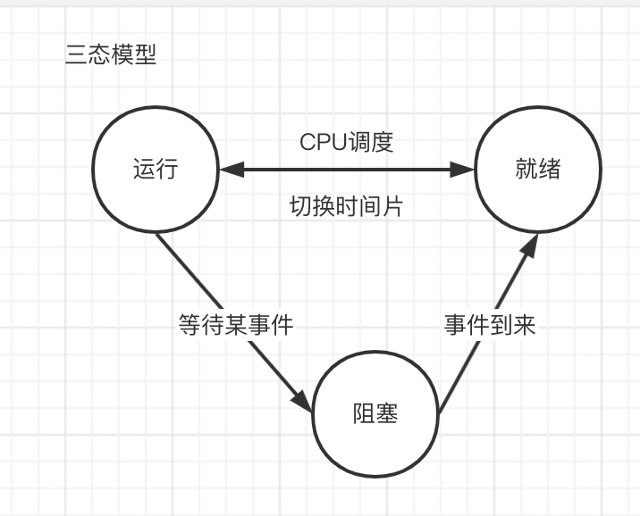
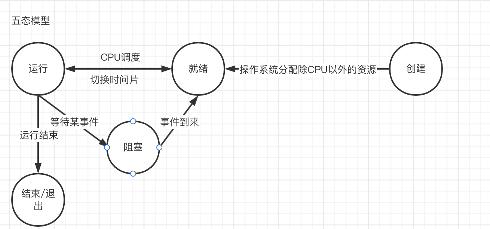
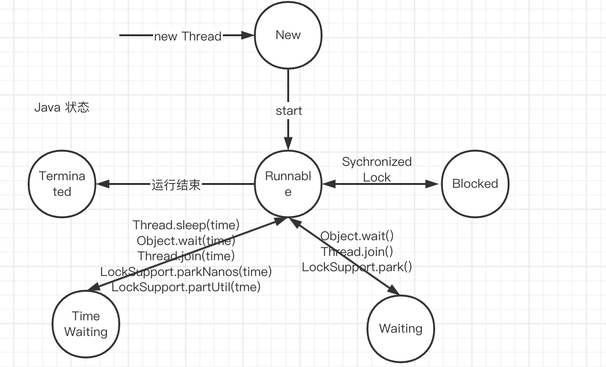

1. 基础概念
2. 状态模型
3. 线程实现
3. 线程池设计

<!-- more -->

# 基础概念

* 进程 是一个具有一定独立功能的程序在一个数据集上的一次动态执行的过程，是操作系统进行资源分配和调度的一个独立单位，是应用程序运行的载体，比如说Java启动一个main方法就启动了一个进程
* 线程 程序执行中一个单一的顺序控制流程，是程序执行流的最小单元，是处理器调度和分派的基本单位，一个进程至少会存在一个线程，比如说Java启动一个main方法就启动了一个进程，同时会存在一个main线程
* 协程 是一种基于线程之上，但又比线程更加轻量级的存在，这种由程序员自己写程序来管理的轻量级线程叫做『用户空间线程』，具有对内核来说不可见的特性

进程与线程的区别和联系

1. 线程是程序执行的最小单位，而进程是操作系统分配资源的最小单位；
2. 一个进程由一个或多个线程组成，线程是一个进程中代码的不同执行路线；
3. 进程之间相互独立，但同一进程下的各个线程之间共享程序的内存空间(包括代码段、数据集、堆等)及一些进程级的资源(如打开文件和信号)，某进程内的线程在其它进程不可见；
4. 调度和切换：线程上下文切换比进程上下文切换要快得多。

# 状态模型

## 三态模型

* 运行 该时刻进程实际占用CPU
* 就绪 可运行，等待CPU分配
* 阻塞 等待某种外部事件发生，否则不能运行

## 五态模型

* 创建 进程正在创建，还不能运行。操作系统在创建进程时要进行的工作包括分配和建立进程控制块表项、建立资源表格并分配资源、加载程序并建立地址空间
* 运行 该时刻进程实际占用CPU
* 就绪 可运行，等待CPU分配
* 阻塞 等待某种外部事件发生，否则不能运行
* 退出 已结束，所以也称结束状态，释放操作系统分配的资源。

## Java 线程状态

* NEW  正在创建，不能运行，new Thread时的线程状态
* RUNNABLE 执行状态 start方法调用
* WAITING 等待状态，可以主动被唤醒，Object.wait()、Thread.join()、LockSupport.park()
* TIME_WAITING 有时间的等待，可以主动被唤醒 Thread.sleep(time)、Object.wait(time)、Thread.join(time)、LockSupport.parkNanos(time)、LockSupport.parkUtil(time)

* BLOCKED   阻塞状态，被锁阻塞Sychronized、Lock，不可以主动唤醒
* TERMINATED 结束状态，线程执行结束

## 线程状态用途

* 判断死锁
* 判断CPU 非常高

# 线程实现

## 基础实现

* 实现Runnable接口
* 继承Thread类
* 实现Callable接口，返回Future，有返回值的类
* 线程池的实现

启动线程只有一种办法，就是new Thread()，通过线程start，线程池实现其实是内部启动了Work线程，是个典型的生产者 - 消费者模型

## 线程的停止

### 基于状态位的实现

### 基于中断状态的实现

## Call/Future实现

## CompletableFuture 实现

# 线程池实现

## 基础参数

* `corePoolSize` 核心线程数
* `maximumPoolSize` 最大线程数
* `keepAliveTime` 线程存活时间
* `timeUnit` 存活时间单位
* `threadFactory` 线程工厂，设置线程名称、线程优先级、是否守护线程
* `workQueue`  阻塞队列
* `rejectedExecutionHandler` 拒绝策略
  * `AbortPolicy` 抛出异常，默认的策略
  * `DiscardPolicy` 直接丢弃
  * `CallerRunsPolicy` 当前线程直接执行
  * `DiscardOldestPolicy` 放弃老的任务，加入当前任务

## 实现原理

